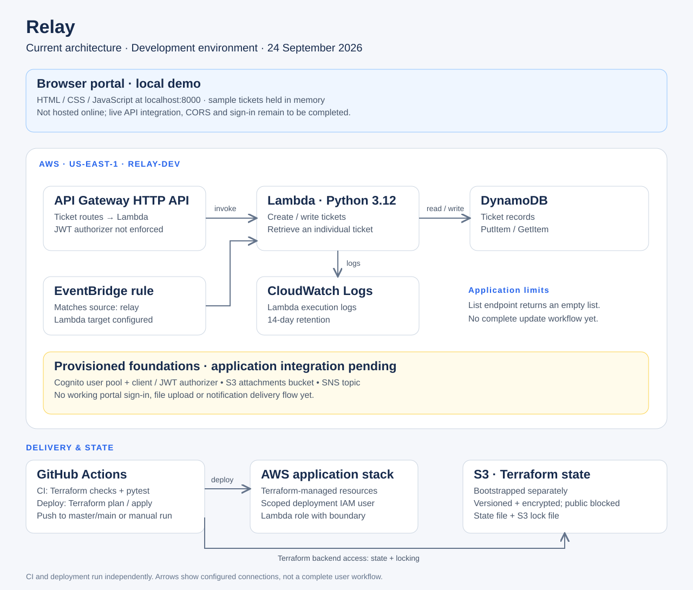

# Relay

Relay is an incident portal for recording service disruptions and tracking their
progress from **open** to **investigating** to **resolved**. It combines a simple
browser interface with an AWS serverless backend, with the aim of giving teams
a shared view of ongoing incidents.

## Current status

Relay is an early prototype. The AWS development backend has been deployed, and
the browser portal runs locally with sample tickets. The portal is not yet
hosted online or connected to the deployed backend as a complete application.

Today, the project includes:

- A browser demo for creating tickets and displaying their status.
- A Python Lambda handler that writes tickets to DynamoDB and retrieves individual
  tickets by ID.
- Terraform configuration for the AWS infrastructure.
- GitHub Actions workflows for infrastructure validation, Python tests, and
  deployment.

Demo tickets are held in browser memory and reset when the page is refreshed.
The API's ticket-list response is currently a placeholder. Authentication,
notifications, attachments, and a complete ticket update workflow still need
application integration; the presence of infrastructure for these features does
not mean they are ready to use. Cognito is provisioned, but the current API routes
do not enforce its JWT authorizer.

## Try the browser demo

With Python 3 installed, run:

```sh
cd web/relay_portal
python3 -m http.server 8000 --bind 127.0.0.1
```

Open [localhost:8000](http://localhost:8000) in your browser.

The portal accepts an optional `api` query parameter for development, but live
integration still needs work, including browser CORS configuration, ticket
loading, and authentication.

## Architecture



[Open the full-size architecture diagram](docs/architecture.svg). This diagram
shows the current development setup, including provisioned components whose
application integration is still pending.

| Component | Purpose |
| --- | --- |
| HTML, CSS, and JavaScript portal | Local incident-management demo |
| API Gateway HTTP API | Routes ticket requests to Lambda |
| Python Lambda | Handles ticket requests |
| DynamoDB | Stores ticket records |
| Cognito | Foundation for user authentication |
| S3 | Attachment bucket and a separate Terraform state bucket |
| EventBridge and SNS | Foundations for event handling and notifications |
| CloudWatch | Lambda logs |

Terraform manages the application infrastructure. Its state is stored in a
separately bootstrapped S3 bucket with encryption, versioning, and public access
blocked.

## Repository layout

```text
web/relay_portal/       Browser demo
services/relay_lambda/ Python handler and tests
infra/relay/           Terraform, deployment policies, and setup notes
.github/workflows/    CI and deployment workflows
```

## Run the tests

```sh
python3 -m venv .venv
source .venv/bin/activate
python -m pip install -r services/relay_lambda/requirements.txt
python -m pytest -q
```

To check the Terraform configuration without connecting to the state backend:

```sh
cd infra/relay
terraform fmt -check
terraform init -backend=false -input=false -lockfile=readonly
terraform validate
```

## Deployment

See the [infrastructure setup guide](infra/relay/README.md) for AWS prerequisites,
state storage, IAM policies, and GitHub secrets. The current configuration targets
the project's development account and `us-east-1`; review account-specific values
before using it in another environment.

Pushes to `master` or `main` trigger CI and a separate deployment workflow.
Deployment can also be started manually through GitHub Actions. CI and deployment
currently run independently, so a successful CI run is not a deployment gate.

The next development steps are to connect and host the portal, enforce sign-in,
complete ticket listing and updates, and integrate priorities, notifications,
and attachments throughout the application.
